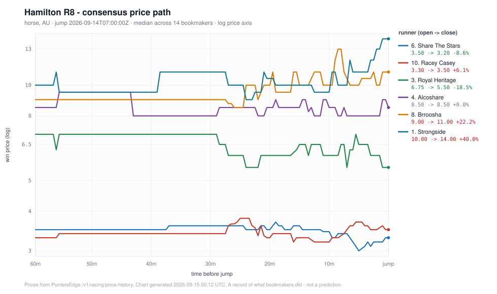

# Racing price movement tracker for Australian horse, harness and greyhound racing

A single-file Python tool that shows how Australian racing prices moved between market
open and the jump: which runners firmed, which drifted, by how much, and what the path
looked like. It prints a per-runner open / close / high / low / move% table with a
terminal sparkline, and writes a standalone SVG chart.

Standard library only. No `pip install`, no matplotlib, no config file. One file,
`pricemove.py`, runs on a bare `python3`. Prices come from the
[PuntersEdge](https://puntersedge.online/api?utm_source=racing-price-movement-tracker&utm_medium=readme)
odds API, which covers Australian thoroughbred, harness and greyhound racing plus NZ
thoroughbred and harness.

## Run it without an API key

The API exposes keyless demo endpoints that cost nothing and need no registration.
`watch` polls one of them on an interval and builds its own price series from the
snapshots it collects:

```sh
git clone https://github.com/Propertyscout001/racing-price-movement-tracker
cd racing-price-movement-tracker
python3 pricemove.py watch --minutes 3
```

That is the whole setup. No key, no dependencies, no account.

One honest caveat about this mode: the demo endpoint returns a *snapshot*, not history,
so `watch` can only see movement that happens while it is running, and a race hours from
the jump barely moves. Run it while the Australian card is live. Asking the API for the
next 24 hours on 2026-09-15 returned 208 Australian races — 138 greyhound, 41 harness,
29 thoroughbred — running from 11:38 to 22:57 AEST, so that is the window worth polling
in. Outside it you will watch a flat market.

### Real output, keyless

Captured 2026-09-15 (AEST): 24 polls over 11 minutes, following an Angle Park greyhound
race about two hours out from its jump. Real terminal output, with a contiguous run of
polls omitted where marked:

```
Polling https://api.puntersedge.online/v1/demo/racing/next-to-go every 25s for 11 minute(s).
No API key, 0 credits. The demo endpoint allows 30 requests/min per IP.

poll 1   23:33:12Z  Angle Park R1  2.1h to jump  ·  15 prices recorded  ·  173 ms
poll 2   23:33:37Z  Angle Park R1  2.1h to jump  ·  0 price changes  ·  48 ms
poll 3   23:34:03Z  Angle Park R1  2.1h to jump  ·  5 price changes  ·  1065 ms
poll 4   23:34:28Z  Angle Park R1  2.1h to jump  ·  0 price changes  ·  38 ms
poll 5   23:34:53Z  Angle Park R1  2.1h to jump  ·  0 price changes  ·  40 ms
poll 6   23:35:18Z  Angle Park R1  2.0h to jump  ·  0 price changes  ·  51 ms
poll 7   23:35:43Z  Angle Park R1  2.0h to jump  ·  4 price changes  ·  71 ms
poll 8   23:36:08Z  Angle Park R1  2.0h to jump  ·  0 price changes  ·  41 ms
rate limited (429), waiting 3s
rate limited (429), waiting 6s
poll 9   23:36:42Z  Angle Park R1  2.0h to jump  ·  0 price changes  ·  52 ms
        ... polls 10-23 omitted, with 7 more rate-limit backoffs ...
poll 24  23:43:57Z  Angle Park R1  1.9h to jump  ·  3 price changes  ·  46 ms

24 poll(s), 45 point(s) collected.

Angle Park R1  (greyhound, AU)
race_id   e79e50b1-bc25-4d1d-976c-6b34d0b6426c
jump      2026-09-15T01:38:00Z
window    from 2.1h to 1.9h before the jump  (11m observed)
source    /v1/demo/racing/next-to-go (keyless, 0 credits, polled by this tool)

#   Runner           Bk    Open  Close   High    Low    Move%  Dir      Path (polled window)
------------------------------------------------------------------------------------------------------------------
2   Sandy Knuckles    7    4.60   5.00   5.00   4.60    +8.70  drifting ▁▁▁▁▁▁▁▁▁▁▁▁▁▁▁▁▁▁▁▁▆▆▆▆▆▅▅▅████████████
1   Alia Rose         6*  13.50  14.00  14.00  13.00    +3.70  drifting ███▁▁▁▁▁▁▁▁▁▁▁▁▁▁▁▁▁▁▁▁▁▁▁▁▁████████████
4   Adhana Remi       9*   3.00   3.00   3.00   2.90    +0.00  steady   ███████████████████████████████████████▁
5   Whiplash Emmett   8*  26.00  26.00  29.00  26.00    +0.00  steady   ▁▁▁▁▁▁▁▁▁▁▁▁▁▁▁▁▁▁▁▁█████▁▁▁▁▁▁▁▁▁▁▁▁▁▁▁
7   Twitching         5*   2.25   2.25   2.25   2.20    +0.00  steady   ███████████████████████████████████████▁
```

That is what eleven minutes of a quiet market looks like, and it is worth being plain
about: one runner moved. Sandy Knuckles went 4.60 out to 5.00 across seven books; the
rest held. The `429` lines are real too — other testing was sharing this IP's demo quota
at the time, and the client backed off and carried on rather than crashing. The same run
also wrote [`docs/demo-watch.svg`](docs/demo-watch.svg).

### See a full race end to end, offline

Because `watch` is limited to what it observes live, this repo also commits a real
captured series from a complete Australian race — every price from market open to the
jump — so you can see the full output immediately with no network call at all:

```sh
python3 pricemove.py render docs/hamilton-r8.json
```

Hamilton R8, an Australian thoroughbred race that jumped 2026-09-14 07:00 UTC.
1,105 price points across 14 runners and all 14 bookmakers the API served for that race.
Captured with this tool on 2026-09-15 (AEST):

```
Hamilton R8  (horse, AU)
race_id   b4b126d9-24a6-4121-9a92-b40dc389a74a
jump      2026-09-14T07:00:00Z
window    from 60m to 9s before the jump  (60m observed)
source    /v1/racing/price-history (keyed, 5 credits)
points    1105

#   Runner           Bk    Open  Close   High    Low    Move%  Dir      Path (open -> jump)
-----------------------------------------------------------------------------------------------------------------
11  Frosty Night     14   23.00  34.00  41.00  21.00   +47.83  drifting ▂▂▄▄▄▄▄▄▄▄▄▄▄▄▁▂▂▂▂▂▂▁▁▁▆▄▄▄▄▃▂▇▆█▄▄▄▆██
1   Strongside       14   10.00  14.00  15.00   9.00   +40.00  drifting ▂▂▄▂▂▂▂▂▂▂▂▂▂▂▄▄▄▄▄▄▄▂▂▁▂▄▂▂▂▂▂▂▂▄▂▄▄▅██
12  State Of Maine   14   16.00  22.00  26.00  15.00   +37.50  drifting ▁▁▁▁▁▁▁▁▁▁▁▁▁▁▁▁▁▁▁▁▄▂▂▂▂▄▄▃▃▄▄▅▆▅▄▆▆███
8   Brroosha         14    9.00  11.00  13.00   8.50   +22.22  drifting ▂▂▂▂▂▂▂▂▂▂▂▂▂▂▂▂▂▂▂▂▂▂▁▄▄▃▄▄▆▄▅▆▄█▆▄▅▆▄▆
13  Suenami Rose     14  126.00 151.00 201.00 126.00   +19.84  drifting ▁▁▁▁▁▁▁▁▁▁▁▁▁▁▁▁▁▁▁▁▁▅▁▁▁▅▃▅▅▅▅▅▁▅▁█▅▅▅▅
3   Royal Heritage   14    6.75   5.50   7.50   5.50   -18.52  firming  ██▅█████████████████▆▃▃▁▁▃▃▃▄▆▆▆▃▃▁▅▆▃▁▁
6   Share The Stars  14    3.50   3.20   3.70   2.80    -8.57  firming  ▇▇▇▇▇▇▇▇▇▇▇▇▇▇▇████████▇▇█▇█▇█▇▇▆▄▆▃▁▃▃▄
10  Racey Casey      14    3.30   3.50   3.80   3.00    +6.06  drifting ▃▃▃▄▄▄▄▄▄▄▄▄▄▄▄▄▄▄▄▄▄▆▇█▆▃▃▃▁▃▃▂▂▃▄▆▇▅▆▅
9   Popthebubbly     14   18.00  19.00  23.00  17.00    +5.56  drifting ▃▃▅▅▅▅▅▅▅▅▅▅▅▅▅▅▅▅▅▅▆▅▁▁▅▅▅▅▅▅▅▅▅▃▅█▃▃▆▅
4   Alcoshare        14    8.50   8.50   9.50   7.50    +0.00  steady   ▃▃▃████████▁▁▁▁▁▁▁▁▁▃▃▃▃▃▁▆▃▃▆▃▂▆▆▁▁▁▁▆▃
7   Astrodean         4*  11.00  11.00  11.00  11.00    +0.00  steady   ▅▅▅▅▅▅▅▅▅▅▅▅▅▅▅▅▅▅▅▅▅▅▅▅▅▅▅▅▅▅▅▅▅▅▅▅▅▅▅▅
2   Min Kiata         4*  11.50  11.50  12.00  11.00    +0.00  steady   ▅▅▅▅▅▅▅▅▅▅▅▅▅▅▅▅▅▅▅▅▅▅▅▅▅▅▅▅▅▅▅▅▅▅▅▅▅▅▅▅
5   Parkrun          14   21.00  21.00  26.00  13.00    +0.00  steady   █████████████████████▅▂▃▂▁▂▂▂▅▅▅▂▂▃▃▅▅▇█
14  Stellar Madame    4*  81.00  81.00  91.00  81.00    +0.00  steady   ▅▅▅▅▅▅▅▅▅▅▅▅▅▅▅▅▅▅▅▅▅▅▅▅▅▅▅▅▅▅▅▅▅▅▅▅▅▅▅▅

* = at least half this runner's books posted a single price only. A book with one
    observation reports a 0.00% move by construction, so it neither confirms nor
    denies a move. 3 of 14 rows are flagged.
```

`Move%` is the consensus close against the consensus open, where consensus is the
**median** across bookmakers rather than the mean, so one book posting an outlier does
not drag the row. Negative means the price shortened (firmed); positive means it
lengthened (drifted). The sparkline is the median price across books, bucketed onto a
shared seconds-to-jump grid, reading left (market open) to right (the jump).

The same command writes the chart below with `--svg`:

```sh
python3 pricemove.py render docs/hamilton-r8.json --svg docs/hamilton-r8.svg
```



The y axis is logarithmic on purpose. Odds are multiplicative — 2.00 to 2.20 is the same
10% move as 10.00 to 11.00 — so a linear axis squashes every short-priced runner into one
indistinguishable band. The SVG is hand-rolled: plain `<path>` and `<text>`, no plotting
library, no embedded fonts.

## With a free key

A [free key](https://puntersedge.online/api?utm_source=racing-price-movement-tracker&utm_medium=readme)
gives 1,500 credits a month with no credit card, and unlocks the keyed modes:

```sh
export PE_API_KEY="your_key_here"
```

| Mode | Endpoint | Credits | What it does |
| --- | --- | --- | --- |
| `watch` | `/v1/demo/racing/next-to-go` | 0 | polls the keyless demo, builds its own series |
| `render` | none (local file) | 0 | re-renders a saved series offline |
| `scan` | `/v1/racing/movers` | 3 per poll | the server's own firming/drifting scan across live races |
| `race` | `/v1/racing/price-history` | 5 per race | full open/close/high/low/move% per runner and book |
| `benchmark` | `/v1/racing/price-history` | 5 per call | re-measures the latency and gzip figures below |

At 5 credits a race, the free tier covers roughly 300 full race histories a month, or
about 500 `scan` polls. Every response carries `X-Credits-Used` and
`X-Credits-Remaining`; the tool prints the running tally after each call.

Scan live races, then pull the full history for one that interests you:

```sh
# what is moving right now on the Australian card
python3 pricemove.py scan --country AU --min-move-pct 5 --min-books 3

# poll it on a schedule: 20 polls, one every 3 minutes (60 credits)
python3 pricemove.py scan --country AU --repeat 20 --interval 180

# the full history for one race, with a chart and a saved series
python3 pricemove.py race --race-id <race_id> --svg chart.svg --json series.json

# or address a race by name instead of id
python3 pricemove.py race --venue Hamilton --race-number 8 --date 2026-09-14
```

`--json` is worth using. Price history costs 5 credits each time you fetch it, so save
the series once and iterate on the table and the chart with `render` for free.

## How it works

Two data sources, one analysis engine. Archived prices from the keyed API and snapshots
polled from the keyless demo are normalised into the same internal shape, so the table,
the sparkline and the SVG are written once and serve every mode.

**`/v1/racing/movers`** (`scan`) is the server-side scan. It returns a consensus move per
runner with a `direction` of exactly `firming` or `drifting` — not `steam`, not `drift` —
along with `books_firming` / `books_drifting` / `books_unchanged` counts, which the tool
prints as `f/d/u` so you can see how broad the move was. Bounds that will 422 you:
`min_move_pct` 1–90, `min_books` 1–12, `max_mins_to_jump` 5–360, `limit` 1–200.

**`/v1/racing/price-history`** (`race`) is the detailed view: every runner, every
bookmaker, with `open_price`, `close_price`, `high`, `low`, `move_pct`, `points_count`
and the raw `points` array of `{win_price, secs_to_jump, captured_at}`. `max_points` must
be at least 100; the response sets `truncated: true` if it hit your cap.

**`/v1/demo/racing/next-to-go`** (`watch`) is keyless and costs nothing.

### Gotchas this tool had to handle

**Racing endpoints are not Australia-only.** This is the one that will embarrass you.
Running `scan` with no country filter, at the loosest thresholds the API accepts
(`min_move_pct=1`, `min_books=1`), at 23:36 UTC on 2026-09-14 — 09:36 on 2026-09-15
Australian eastern time, before the Australian card had opened:

```
[23:36:06Z] 12 movers  ·  182 ms  ·  1 call, 3 credits (remaining: unlimited)
  Venue            Race Category   Jump  #   Runner             Dir        Open    Now    Move%  f/d/u
  ----------------------------------------------------------------------------------------------------
  Mountaineer Park R3   horse       13m  8   Unstable Mabel     drifting   7.00   9.00   +28.57  0/1/0
  Mountaineer Park R3   horse       13m  1   Fiveminutsofpasion drifting   5.50   7.00   +27.27  0/1/0
  Mountaineer Park R3   horse       13m  2   General Ginny      drifting  12.00  15.00   +25.00  0/1/0
  Mountaineer Park R3   horse       13m  3   A Little Bit Crazy drifting   6.00   7.00   +16.67  0/1/0
  Mountaineer Park R3   horse       13m  4   Opposite The Crowd firming    3.00   2.60   -13.33  1/0/0
  Mountaineer Park R3   horse       13m  7   Loaded Once More   firming    4.00   3.50   -12.50  1/0/0
  Assiniboia Downs R1   horse       53m  1   Princess Aleska    drifting   7.00   7.50    +7.14  0/1/0
  Mountaineer Park R3   horse       13m  5   Worth Considering  drifting  18.00  19.00    +5.56  0/1/0
  Assiniboia Downs R1   horse       53m  4   Play Free Bird     drifting   9.50  10.00    +5.26  0/1/0
  Assiniboia Downs R1   horse       53m  3   Kikilove           drifting   3.60   3.70    +2.78  0/1/0
  Assiniboia Downs R1   horse       53m  5   Hardly Mischievous drifting   2.35   2.40    +2.13  0/1/0
  Assiniboia Downs R1   horse       53m  2   Norma No           drifting   2.70   2.75    +1.85  0/1/0
```

Mountaineer Park is in West Virginia and Assiniboia Downs is in Manitoba. Not one
Australian runner in twelve rows. Always pass `country=AU` — the tool defaults to it —
or you will publish North American and Japanese races under an "Australian racing"
heading.

**But `country=AU` alone can silently return nothing.** Most of an Australian card has an
unresolved country until the meeting is confirmed, and those races are excluded by
default. When `scan` gets zero rows with a country filter set it says so and tells you to
retry with `--include-unresolved` rather than leaving you to assume the market is quiet.

**The demo endpoint wraps its payload; the keyed endpoints do not.** `/v1/demo/*` returns
`{"demo":…, "note":…, "shape":…, "races":[…]}`. `/v1/racing/next-to-go` returns a bare
array. Code that handles one will not handle the other.

**The demo endpoint rate-limits at 30 requests/min per IP**, and a 429 returns RFC 9457
`problem+json`, not the envelope — so a client that assumes success will throw a
`KeyError` on `races` rather than report a rate limit. This tool backs off and retries.
It was measured during this build: bursty testing tripped it repeatedly.

**A book with one observation reports a 0.00% move by construction.** It never had a
second price to move to, so it neither confirms nor denies a move. Rows where at least
half the books are single-observation are flagged `*` in the table, and such runners are
de-prioritised in the SVG, because forward-filling one point draws a flat line that looks
like a market holding firm when it is really just one sample.

**gzip and connection reuse are worth the four lines.** The tool sends
`Accept-Encoding: gzip` and holds one `http.client.HTTPSConnection` open across every
call in a run. Fetching the same Hamilton R8 history five times each way, 2026-09-14
23:34 UTC:

| | median latency |
| --- | --- |
| new TLS connection per call | 198 ms |
| one connection reused | 96 ms |

That response was 9,458 bytes on the wire and 142,928 decompressed — 15.1x. Do not take
either number on trust; the measurement is a mode of the tool, so re-run it yourself:

```sh
python3 pricemove.py benchmark        # 11 calls, 55 credits
```

**No silent retries on price endpoints.** A hidden retry can hand you a price recorded
before a move, which is worse than an error. The client never retries a response it
actually received — no 5xx retry, no 4xx retry. It reconnects exactly once when a
*reused* keep-alive connection was dropped before any response byte arrived, and says so
on stderr when it does.

## What price movement does and does not tell you

Price movement is a record of what bookmakers did. It is not a signal, and this repo
makes no claim about predicting results.

A price moves because a bookmaker changed it. Bookmakers change prices for many reasons
that have nothing to do with the likely outcome: balancing their own book, following a
competitor, reacting to a scratching, adjusting for a promotion, or correcting a mistake.
A shortening price and a runner's actual chance are different things, and the gap between
them is not something this tool measures or could measure.

What the data honestly supports is descriptive work. You can see when a market opened,
how wide the books were at open versus at the jump, which books moved first and which
followed, how much of a move was one outlier against a broad repricing, and how far a
consensus travelled over an hour. That is a reasonable input to research, a market
monitor, a data-quality check, or a dashboard. It is not a forecast, and a table of
past movement says nothing about the next race.

## Limitations

- **`watch` cannot see the past.** The demo endpoint is a snapshot. Movement that
  happened before you started polling is invisible to it. Only the keyed
  `/v1/racing/price-history` has the archive.
- **`scan` only sees live races.** `max_mins_to_jump` caps at 360, so it is forward-looking
  by design. There is no way to scan for movers on a race that has already jumped.
- **This repo does not build on `/v1/racing/closing-lines`.** That endpoint is plan-gated
  and returns 403 on the free tier, so an example built on it would fail for exactly the
  readers this repo is written for. `/v1/racing/price-history` is the free-tier
  equivalent and carries the same open / close / high / low / move_pct per runner-book.
  (The 403 is documented behaviour; this build used an internal unlimited key and so did
  not reproduce it first-hand.)
- **History has a floor.** The archive starts 2026-08-04 — the response reports it as
  `history_from`. Older races are not available at any plan.
- **Consensus is a median, not a market.** It is a summary statistic across whichever
  books were quoting, not a traded price. There is no exchange or volume data here.
- **No Betfair, no Pinnacle.** The feed does not carry them, so there is no exchange
  price or traded volume anywhere in this tool.
- **Bookmaker coverage varies race to race.** Hamilton R8 had all 14 books; a small
  midweek meeting may have far fewer. Check the live
  [coverage report](https://puntersedge.online/coverage-report?utm_source=racing-price-movement-tracker&utm_medium=readme)
  rather than trusting a number hardcoded in a README.
- **No results, no form, no settlement.** This tool reads prices only. It does not know
  which runner won, and deliberately does not join movement to outcome.
- **Single-threaded and synchronous.** One connection, one race at a time. Fine for a
  terminal tool; not a bulk ingest pipeline. For bulk work the API has CSV endpoints.
- **NZ greyhounds do not exist in the feed.** AU covers thoroughbred, harness and
  greyhound; NZ covers thoroughbred and harness only.

## Command reference

```
python3 pricemove.py watch  [--interval 20] [--minutes 5] [--race-index 0]
python3 pricemove.py render <series.json>
python3 pricemove.py scan   [--country AU] [--include-unresolved] [--min-move-pct 10]
                            [--min-books 3] [--direction firming|drifting]
                            [--categories horse,harness,greyhound]
                            [--max-mins-to-jump 360] [--limit 50]
                            [--repeat 1] [--interval 120]
python3 pricemove.py race   (--race-id ID | --venue V --race-number N --date YYYY-MM-DD)
                            [--books tab,sportsbet] [--max-points 5000]
python3 pricemove.py benchmark [--race-id ID] [--n 5]
```

Shared by `watch`, `render` and `race`: `--svg PATH`, `--svg-runners 6`, `--json PATH`,
`--sort move|firming|drifting|price|number`, `--top N`, `--buckets 40`, `--ascii`.

Use `--ascii` if your terminal renders the Unicode block sparkline as boxes.

## Related

PuntersEdge guides relevant to this tool:

- [Betting line movement tracker in Python](https://puntersedge.online/blog/betting-line-movement-tracker-python?utm_source=racing-price-movement-tracker&utm_medium=readme)
- [Historical racing odds API](https://puntersedge.online/developers/historical-racing-odds-api?utm_source=racing-price-movement-tracker&utm_medium=readme)
- [Australian horse racing API guide](https://puntersedge.online/blog/horse-racing-api-australia-guide?utm_source=racing-price-movement-tracker&utm_medium=readme)
- [Market report](https://puntersedge.online/market-report?utm_source=racing-price-movement-tracker&utm_medium=readme)
- [Getting started](https://puntersedge.online/developers/getting-started?utm_source=racing-price-movement-tracker&utm_medium=readme)
 · [API reference](https://puntersedge.online/developers/api-reference?utm_source=racing-price-movement-tracker&utm_medium=readme)
 · [OpenAPI spec](https://api.puntersedge.online/openapi.json)

Sibling repositories, all standalone:

- [puntersedge-python](https://github.com/Propertyscout001/puntersedge-python) — the official Python SDK on PyPI
- [puntersedge-node](https://github.com/Propertyscout001/puntersedge-node) — the Node SDK on npm
- [puntersedge-mcp](https://github.com/Propertyscout001/puntersedge-mcp) — MCP server, for asking an LLM about the feed
- [au-racing-odds-dashboard](https://github.com/Propertyscout001/au-racing-odds-dashboard) — next-to-go board, single stdlib file
- [puntersedge-examples](https://github.com/Propertyscout001/puntersedge-examples) — six standalone example scripts

Full terminal transcripts for every run quoted above are in
[`docs/output.txt`](docs/output.txt).

---
18+ only. Gambling can be addictive — please gamble responsibly.
Gambling Help: 1800 858 858 · https://www.gambleaware.nsw.gov.au
This repository is a developer example for reading an odds data feed. It is not betting
advice, it places no bets and it holds no bookmaker credentials.
